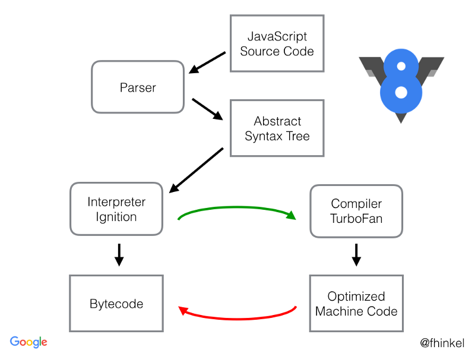
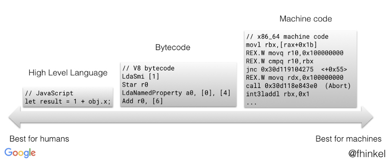

# Bytecode in V8

> Bytecode is an abstraction of machine code

V8 引擎编译代码的过程如下：

- parser 生成代码对应的 AST，
- interpreter 从 AST 中生成 bytecode
- optimizing compiler 将 bytecode 转化为优化后的机器码




> Ignition is a register machine with an accumulator register

V8 采用的 interpreter 使用的是具有累加器的寄存器，使用和物理 CPU 类似的计算模型。

Bytecode 可以看做执行 JavaScript 的最小 building block。V8 中有上百种不同的
bytecode，例如：

- `Add`
- `TypeOf`
- `CreateObjectLiteral`

等等。

作为运算符，每个字节码可以将寄存器作为运算元进行输入和输出。例如：

- `Add r1`：将寄存器 `r1` 的值和累加器中的值做加法运算
- `Ldasmi [42]`：将小整数 `42` 放入累加器中
- `Star r0`：将累加器中的值放入寄存器 `r0` 中

> If you want to see V8's bytecode of JavaScript code, you can print it by calling D8 or Node.js (8.3 or higher) with the flag --print-bytecode. For Chrome, start Chrome from the command line with --js-flags="--print-bytecode", see Run Chromium with flags.

```
$ node --print-bytecode incrementX.js
...
[generating bytecode for function: incrementX]
Parameter count 2
Frame size 8
  12 E> 0x2ddf8802cf6e @    StackCheck
  19 S> 0x2ddf8802cf6f @    LdaSmi [1]
        0x2ddf8802cf71 @    Star r0
  34 E> 0x2ddf8802cf73 @    LdaNamedProperty a0, [0], [4]
  28 E> 0x2ddf8802cf77 @    Add r0, [6]
  36 S> 0x2ddf8802cf7a @    Return
Constant pool (size = 1)
0x2ddf8802cf21: [FixedArray] in OldSpace
 - map = 0x2ddfb2d02309 <Map(HOLEY_ELEMENTS)>
 - length: 1
           0: 0x2ddf8db91611 <String[1]: x>
Handler Table (size = 16)
```

## Reference

- [Understanding V8’s Bytecode – DailyJS – Medium](https://medium.com/dailyjs/understanding-v8s-bytecode-317d46c94775)
