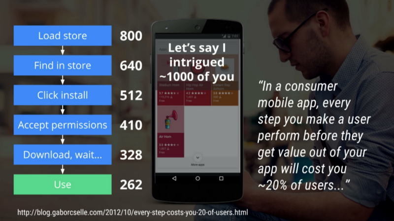

# 背景

> Once every few years, the web experiences a pivotal moment. A moment where
> several separate technologies click together and make a splash in the public’s
> eye. These may be existing technologies that have been around for years or
> newer ones that have just now gained browser support. But to the outside
> observer, it seems like there is one shining moment in which the web suddenly
> takes a leap forward.

Progressive Web Apps 是由自由职业设计师 [Frances Berriman](https://fberriman.com/) 和 Google Chrome 团队成员 [Alex Russell](https://infrequently.org/about-me/) 于 2015 年提出的概念。经过 2016 年 Google I/O 大会的推广后，成为一个炙手可热的新技术。

## 移动应用面临的问题与现有方案

众所周知，在 2007 年由苹果公司对 Web 技术在移动应用的尝试失败后，原生应用(native
app) 成为了移动应用的主流。根据 ComScore 的统计，
[2016 移动用户在原生应用上的使用时间是 Web 和 Web 应用上的 7 倍之多](https://www.comscore.com/Insights/Presentations-and-Whitepapers/2016/The-2016-US-Mobile-App-Report)。

一直以来，相对于 Web 应用，原生应用在已下几个方面有绝对优势：

- 硬件体验：在 Web 开发过程中，对摄像头/麦克风/加速度传感器等硬件的调用，会遇到
  很严重的浏览器的支持或者兼容问题。
- OS 功能：推送通知，获取用户的地理位置等。
- 不依赖网络连接：在网络连接不稳定下，原生应用有更好的表现。此外，Web 应用打开时，会有
  难看的白屏。
- 流量成本：省去了浏览器一层，原生应用可以节省用户的流量成本。
- 留存率：原生应用就在系统的桌面上，在留存率上有先天优势。

作为对比，Web 应用的优势包括：

- 在解决浏览器兼容问题的前提下，天然跨平台和终端。
- 迭代成本低，可以保证用户使用最新版本的应用。
- 无需安装成本。
- 原生应用要为不同的平台进行设计和开发，有不同的规范和语言，Web 应用的工作量小很
  多。

此外，由于搜索引擎在移动端的入口功能的弱化，移动应用在推广上有很大的难度。据统计, [移动用户 80% 左右的使用时间，是使用固定的 3 个 App，与此同时，80% 的用户，平均每个月新下载的应用在 1 个以下](https://www.slideshare.net/comScoremarcom/comscore-2016-us-mobile-app-report)。应用商店作为移动端用户寻找应用的入口，因其封闭性和对 SEO 的不友好，并不能完全替代搜索引擎在桌面环境下的功能。

因此，许多互联网企业往往会在网站被移动用户访问时，向用户推荐原生引用，尽量留存在用户的桌面上，而不是浏览器的收藏夹。

然而这也不能解决原生应用的入口问题，用户要安装一个原生应用，需要：

- 进入应用商店
- 搜索应用
- 点击安装
- 接受应用授权 （安卓用户）
- 等待下载和安装
- 打开

[据统计，以上每一步，平均都会失去 20% 的用户。](https://www.youtube.com/watch?v=qmE_jpnYXFo&feature=youtu.be&t=96)

综上所述，Web 应用与原生应用各有优缺点。由于 Web 应用的使用需要额外经过一层浏览器的运行，很多情况下会导致难以容忍的性能和兼容性问题。因此，在 2011 年 Facebook 和 Google 放弃在移动端推广 Web 应用之后，长期以来在移动端是原生应用占据绝对优势。而 Web 应用的灵活性，也带来了很多融合 Web 应用于原声应用的方案，包括：

- 以 hybrid App 为代表的，在原生应用中嵌入 Web 网页。原生应用一般会提供显示网页内容的接口（如 iOS 中的 `UIWebView`），利用此类接口可以开发混合 Web 与原生的应用。此类方案一般用于解决原生应用的迭代成本问题（无需应用商店即可更新）。不过这种方案在今年已经被苹果公司禁止。
- 以 React Native 和 Weex 为代表的，所谓的 "Compile to native" 的方案。背靠近年流行的 React 和 Vue 技术，将前端的技术作为框架，以 Objective C 和 Java 当做各自平台的汇编语言，并以此实现跨平台。此类方案的作用是解决不同平台需要不同的语言与框架进行开发的问题。国内支付宝已经开始采用并部署这一方案。

## PWA 的内核

PWA 是 Web 社区对原生应用的又一次反击与融合的尝试，其主要观点是：Web 的发展方向应该是”在保留灵魂的基础上渐进增强”，而非现在大行其道的 Hybrid App 方向。

其中，"Progressive" 包含有 2 层含义：

- 如果用户需要，网页可以渐进式地变成 App，比如被添加到主屏幕、全屏方式运行、离线工作、推送通知消息等。但它仍是 Web 而非放到 App Store 里。
- 所有这些“使得 Web 更能与 App 匹敌”的特性都是以渐进的方式增强的，在比传统网页应用更好的同时也保证了降级兼容。

PWA 提供了一种这样的用户体验：

- 用户因为某种需求，来到你的网站。这种情形可能发生于用户来你的餐厅用餐，或者用户在搜索引擎中搜索如何治疗失眠并看到了你的网站，或者看到了街边你的网站的二维码，等等。
- 用户使用你的网站，并在结束后关掉浏览器。
- 因为你的网站或者产品有不错的体验，用户第二次来到你的网站。这时这个应用询问用户，
  是否愿意将这个应用放置在桌面上。由于第一次的体验，用户选择同意。
- 你的网站为用户提供了完整的原生应用级别的体验。在用户开始熟悉你的应用之后，这个应用开始询问用户是否同意接受推送信息。
- 在用户开始信任你的应用之后，根据需要，询问用户是否接受开放地理信息/文件系统权限/麦克风等等。

这样，从一个简单的网页浏览开始，这个 PWA 应用逐步取得用户的信任。用户不需要在应用商店一揽子地接受是否愿意将应用放到桌面并询问是否开放权限，

在移动平台成为大公司战场的如今，PWA 的出现，为"小而美"的应用开发者提供了新的方向。

## PWA 依赖的技术

PWA 的出现，依赖于多个关键技术的成熟:

- Service worker 和 Cache Storage：显著提高应用的加载速度，同时使得离线 Web 应用
  成为可能。
-
