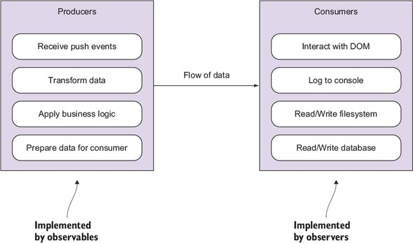
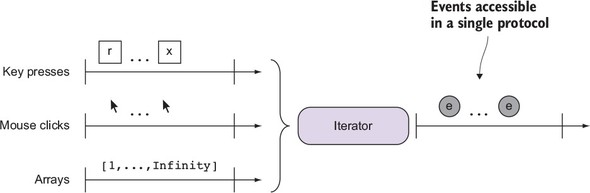

# 基本概念与编程范式

JS 社区有大量的库和编程范式用于处理异步编程，例如 JQuery, Async.js, Q.js，以及
generator, Promise，async/await，常见的异步编程会遇到的问题有：

- 常见的控制流（`for`, `while`)等，并不是 async aware 的。
- Error handling 应用在异步的执行过程中并不是很好的体验
- 业务逻辑在 callback 中的耦合
- excessive use of closure
- 如何取消一个已经正在运行的异步过程
- 如何对一个过程在单位时间内的执行次数进行节流

RxJS 提供了一种 functional / reactive 的范式，将一切数据的处理转化为 data over
time，也就是 stream。

> Traditionally, the term stream was used in programming languages as an
> abstract object related to I/O operations such as reading a file, reading a
> socket, or requesting data from an HTTP server. For instance, Node.js
> implements readable, writable, and duplex streams for doing just this. In the
> RP world, we expand the definition of a stream to mean any data source that
> can be consumed.

RxJS 应用到
了 [Observer pattern](https://www.wikipedia.org/en/Observer_pattern)，在发布/订
阅的基础上，提供了 complete indicator, lazy initialization, cancellation, 资源管
理和清除等功能。

> RxJS brings this notion of continuous sequences of events over time as a
> first-class citizen of the language.

在 data over time 这种模型下，可以将异步获得的数据视为同步的，例如，一系列的鼠标
事件，在 RxJS 的模型下，可以视为鼠标事件的数组。

## Rx stream 的组成

- Producer
- Consumer
- Data pipeline
- Time

Producer 是数据的生产者，在 observer pattern 中，被称为 `subject`，在 RxJS 中，
被称为 `observable`。

Observable 以一种 "fire and forget" 的方式将数据推送给 Consumer (Observer)。

数据单向地从 Observable 流向 Observer，在这一过程中数据可以通过 observable
operator 进行处理和加工。

## Reactive 编程范式

Reactive 的思想取自于 Observer pattern, Iterator pattern 以及 functional programing.

> Unlike in OOP where state or data is held in variables or collections, state
> in RP is transient, which means that data never remains stored but actually
> flows through the streams that are being subscribed to, which makes event
> handling easy to reason about and test.

以及，

> On the other hand, RxJS code encourages you to write declaratively, which
> means your code expresses the what and not the how of what you’re trying to
> accomplish. RxJS follows a simple and declarative design inspired by FP.

> think in terms of streams (think reactively) and design code that, instead of
> holding onto data, allows data to flow through and applies transformations
> along the way until it reaches your desired state.

Reactive 借用了 FP 的核心思想：

- Declarative
- Immutable
- Side effect free

> Moreover, the business logic of this program is pure and takes advantage of
> side effect–free functions that are mapped onto the stream to transform the
> produced data into the desired outcome.




## Reactive Manifesto

[The Reactive Manifesto](https://www.reactivemanifesto.org/)

### 惰性求值

```js
Stream.range(1, Number.POSITIVE_INFINITY)
  .take(100)
  .subscribe(console.log);

Stream.fromEvent('mousemove')
   .map(e => [e.clientX, e.clientY])
   .subscribe(console.log);
```

### Iterator pattern

> Iterators abstract the traversal mechanism, whether a for or a while loop, so
> that processing any type of data is done in the exact same way.



RxJS 中的 stream 遵从 JavaScript 的 `Iterator` 接口。

### data / behavior separation

和面向对象不同，ReactiveX 将数据与行为相剥离。stream 以数据为中心，将数据的处理
交给 observer。
